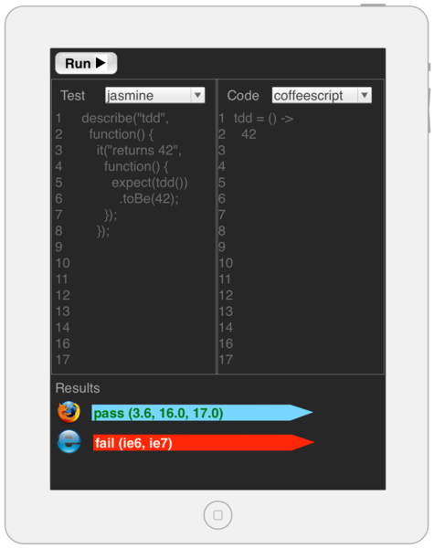

<!SLIDE subsection incremental>
# BDD
* Behavior Driven Development
* Focus on **Outcomes**

<!SLIDE subsection small>
# Example: TDD Tool for JavaScript
* Think jsfiddle.net or jsbin.com

<!SLIDE subsection smaller>
# Wireframe

<!SLIDE subsection smaller>
# BDD

## User Story (Value Proposition)

    @@@ cucumber
    As a developer
    I want to interactively test my javascript
    So I can have confidence in its correctness

## Acceptance Test

    @@@ cucumber
    Given a javascript function and a test for that function
    When I type the javascript function into the code panel
    And I type the test into the test panel
    And I click "Run"
    Then I should see "Test Passed" in the result area

<!SLIDE subsection code smaller>
# BDD First Attempt

    @@@ html
    <button id="run">Run ▶</button>
    <textarea id="test" 
              placeholder="Enter Test Here" rows="10">
    </textarea>
    <textarea id="code" 
              placeholder="Enter Code Here" rows="10">
    </textarea>
    
Results

    

<!SLIDE subsection accepts-input>
# BDD First Example
<button id="run">Run ▶</button>
<textarea id="test" placeholder="Enter Test Here" rows="10">Test Goes Here</textarea>
<textarea id="code" placeholder="Enter Code Here" rows="10">Code Goes Here</textarea>

Results

<!SLIDE subsection bullets incremental>
# BDD First Example

* Wait, was that a test?
* Where do we go next?

