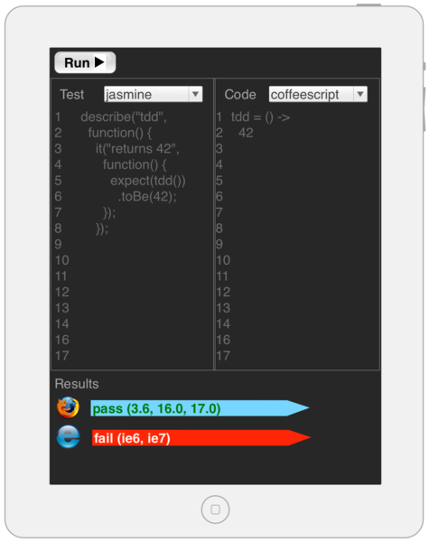

<!SLIDE subsection incremental>
# BDD
* Behavior Driven Development
* Focus on **Outcomes**

<!SLIDE subsection small>
# Example: TDD Tool for JavaScript
* Think jsfiddle.net or jsbin.com

<!SLIDE subsection smaller>
# Wireframe

<!SLIDE subsection smaller>
# BDD

## User Story (Value Proposition)

    @@@ cucumber
    As a developer
    I want to interactively test my javascript
    So I can have confidence in its correctness

## Acceptance Test

    @@@ cucumber
    Given a javascript function and a test for that function
    When I type the javascript function into the code panel
    And I type the test into the test panel
    And I click "Run"
    Then I should see the test passing

<!SLIDE>
# Jasmine

* Set Up
    @@@ javascript
    // 
