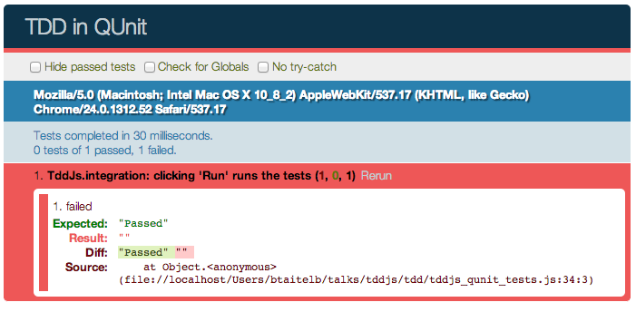
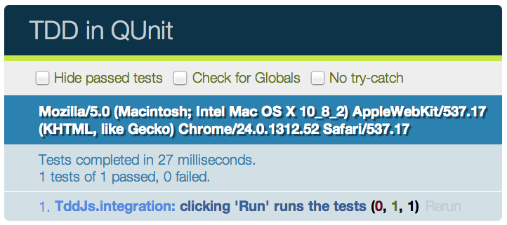

<!SLIDE subsection code smaller small-hrefs>
# BDD w/ QUnit - Setup

    @@@ html
    <!DOCTYPE html>
    <html>
      <head>
        <meta charset="utf-8">
        <title>TDD in QUnit</title>
        <link rel="stylesheet" 
              href="http://code.jquery.com/qunit/qunit-1.10.0.css">
        
      </head>
      <body>
        

        

        
        
      </body>
    </html>

<!SLIDE subsection code smaller>
# BDD w/ QUnit - Integration Test

    @@@ javascript
    module("TddJs.integration");

    test("clicking 'Run' runs the tests", function() {
      var test = 'equal(myFunction(), 42);';
      var code = 'myFunction = function() { return 42; };';
      $("#test").val(test);
      $("#code").val(code);
      $("#run").click();
      equal($("#result").text(), 'Passed');
    });

<!SLIDE subsection>
# BDD w/ QUnit - Integration Test Result

<!SLIDE subsection code smaller>
# BDD w/ QUnit - STTCPW

    @@@ javascript
    module("TddJs.integration", {
      setup: function() {
        var $fixture = $("#qunit-fixture");
        $fixture.append('
Passed
');
      }
    });

    test("clicking 'Run' runs the tests", function() {
      var test = 'equal(myFunction(), 42);';
      var code = 'myFunction = function() { return 42; };';
      $("#test").val(test);
      $("#code").val(code);
      $("#run").click();
      equal($("#result").text(), 'Passed');
    });

<!SLIDE subsection>
# BDD w/ QUnit - Integration Test Result

<!SLIDE subsection code smaller red>
# BDD w/ QUnit - Make It Fail!

    @@@ javascript
    test("clicking 'Run' runs the tests", function() {
      equal($("#result").text(), '', "no results initially");
      var test = 'equal(myFunction(), 42);';
      var code = 'myFunction = function() { return 42; };';
      $("#test").val(test);
      $("#code").val(code);
      $("#run").click();
      equal($("#result").text(), 'Passed');
    });

<!SLIDE subsection code smaller>
# BDD w/ QUnit - Make It Pass

    @@@ javascript
    module("TddJs.integration", {
      setup: function() {
        var $fixture = $("#qunit-fixture");
        $fixture.append('<button id="run">Run</button>');
        $("#run").on("click", function() {
          $fixture.append('
Passed
');
        });
      }
    });

    test("clicking 'Run' runs the tests", function() {
      equal($("#result").text(), '', "no results initially");
      var test = 'equal(myFunction(), 42);';
      var code = 'myFunction = function() { return 42; };';
      $("#test").val(test);
      $("#code").val(code);
      $("#run").click();
      equal($("#result").text(), 'Passed');
    });

<!SLIDE subsection bullets incremental>
# BDD w/ QUnit - Discussion

  * What next?
  * How do we make this less ugly?

