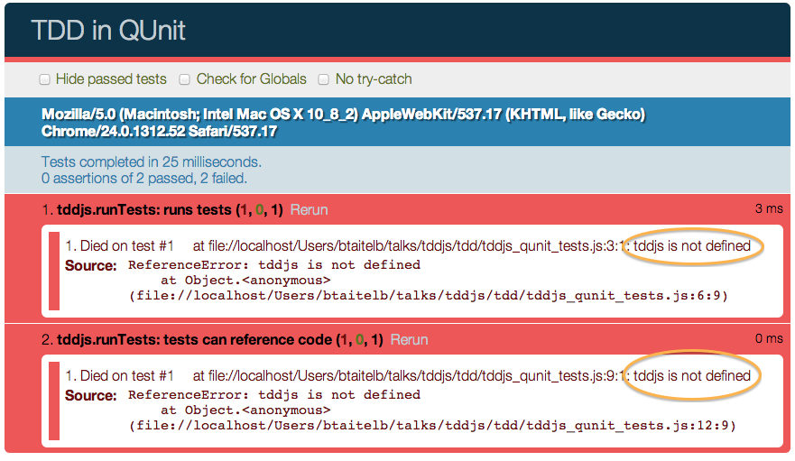
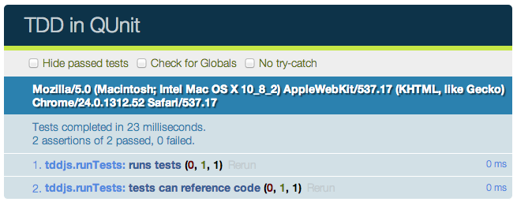

<!SLIDE code smaller small-hrefs subsection>
# QUnit TDD - Setup

    @@@ html
    <!DOCTYPE html>
    <html>
      <head>
        <meta charset="utf-8">
        <title>TDD in QUnit</title>
        <link rel="stylesheet" 
              href="http://jquery.github.com/qunit/qunit/qunit.css">
        
      </head>
      <body>
        

        

        
        
      </body>
    </html>

<!SLIDE code smaller subsection>
# QUnit Test

    @@@ javascript
    module("tddjs.runTests");

    test("runs tests", function() {
      var test = '5;';
      var code = '';
      var actual = tddjs.runTests(test, code);
      var expected = 5;
      var optionalMsg = "expected output to be 5";
      equal(actual, expected, optionalMsg);
    });

    test("tests can reference code", function() {
      var test = 'myFunction();';
      var code = 'function myFunction() { return 42; };';
      equal(tddjs.runTests(test, code), 42);
    });

<!SLIDE subsection>
# QUnit Test Result

<!SLIDE subsection code smaller>
# Make the Tests Pass

Reference our library code from qunit html:

    @@@ html
    

In the library code (tddjs.js):

    @@@ javascript
    var tddjs = {};
    tddjs.runTests = function(tests, code) {
      eval(code);
      return eval(tests);
    };

<!SLIDE subsection>
# QUnit Test Result

<!SLIDE subsection bullets>
# Iterate

* **Refine** Tests
* **Refactor** Code
* **Repeat** Until Satisfied

