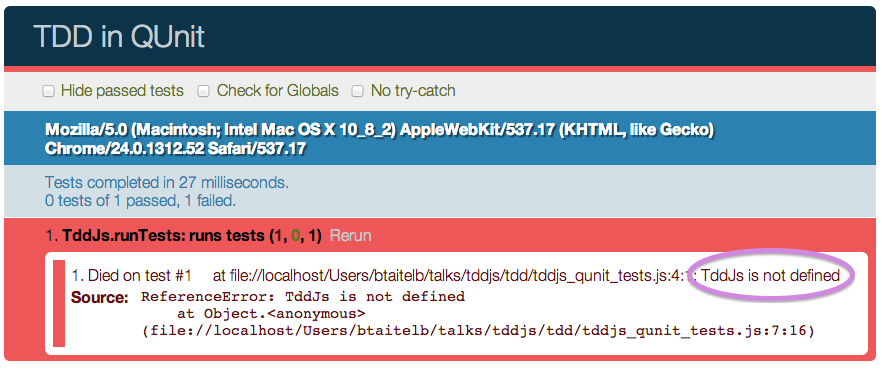
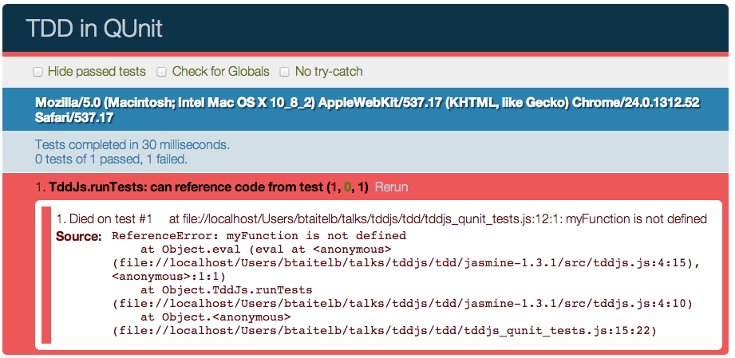

<!SLIDE code smaller small-hrefs subsection>
# QUnit TDD - Setup

    @@@ html
    <!DOCTYPE html>
    <html>
      <head>
        <meta charset="utf-8">
        <title>TDD in QUnit</title>
        <link rel="stylesheet" 
              href="http://code.jquery.com/qunit/qunit-1.10.0.css">
        
      </head>
      <body>
        

        

        
        
      </body>
    </html>

<!SLIDE code smaller subsection>
# QUnit Unit Test

    @@@ javascript
    module("TddJs.runTests");

    test("runs tests", function() {
      var test = '5;';
      var code = '';
      var actual = TddJs.runTests(test, code);
      var expected = 5;
      var optionalMsg = "expected output to be 5";
      equal(actual, expected, optionalMsg);
    });

<!SLIDE subsection>
# QUnit Unit Test Result

<!SLIDE subsection code smaller>
# Make It Pass - Create a Library

## Add Library to HTML:

    @@@ html
    

## Start Simple:

    @@@ javascript
    var TddJs = {};
    TddJs.runTests = function(tests, code) {
      return eval(tests);
    }

<!SLIDE subsection code smaller red>
# Make a Failing Test

    @@@ javascript
    module("TddJs.runTests");

    test("can reference code from test", function() {
      var test = 'myFunction();';
      var code = 'myFunction = function() { return 42; }';
      var actual = TddJs.runTests(test, code);
      var expected = 42;
      equal(actual, expected);
    });

<!SLIDE subsection>
# QUnit Unit Test Result

<!SLIDE subsection code smaller>
# Make It Pass

    @@@ javascript
    var TddJs = {};
    TddJs.runTests = function(tests, code) {
      eval(code);
      return eval(tests);
    }

<!SLIDE subsection code smaller>
# What's Missing?

    @@@ javascript
    asyncTest("executed when run clicked", function() {
      expect(1);
      var mockRunTests = function() {
        ok(true);
        start();
      };
      TddJs.runTests = mockRunTests;
      $("#run").click();
    });