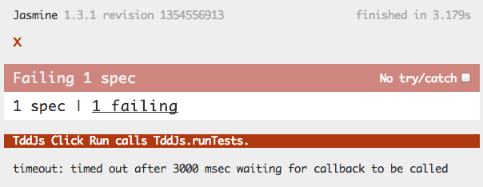
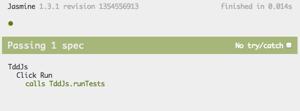

<!SLIDE subsection>
# Jasmine TDD - Setup

  * https://github.com/pivotal/jasmine/downloads
  * Edit SpecRunner.html

<!SLIDE subsection code smaller>
# Jasmine TDD (Async)

    @@@ javascript
    describe("TddJs", function() {
      describe("Click Run", function() {
        it("calls TddJs.runTests", function() {
          var runTestsCalled;

          runs(function() {
            runTestsCalled = false;
            var mockRunTests = function() {
              runTestsCalled = true;
            };
            TddJs.runTests = mockRunTests;
            $("#run").click();
          });

          waitsFor(function() {
            return runTestsCalled;
          }, "mockRunTests never called", 5000);

          runs(function() {
            expect(runTestsCalled).toBeTruthy();
          });
        });
      });
    });

<!SLIDE subsection code smaller>
# Jasmine TDD w/ Sinon

    @@@ javascript
      describe("TddJs", function() {
        describe("Click Run", function() {
          it("calls TddJs.runTests", function() {
            var callback;

            runs(function() {
              callback = sinon.spy();
              TddJs.runTests = callback;
              $("#run").click();
            });
            waitsFor(function() {
              return callback.called;
            }, "callback to be called", 3000);
            runs(function() {
              expect(callback.called).toBeTruthy();
            });

          });
        });
      });

<!SLIDE subsection>
# Jasmine Failing

<!SLIDE subsection>
# Jasmine Passing

<!SLIDE subsection bullets>
# Digging Deeper

  * Who's responsible for sending args to `runTests`?
  * Who _should_ be responsible?
  * Where do we test?

<!SLIDE subsection code smaller>
# Digging Deeper Option #1

    @@@ javascript
    it("calls runTests with correct args", function() {
      var tests, callback;
      tests = "5;";
      $("#tests").val(tests);
      callback = sinon.spy();
      TddJs.runTests = callback;
      $("#run").click();
      expect(callback.getCall(0).args[0]).toEqual(tests);
    });

<!SLIDE subsection code smaller>
# Digging Deeper Option #2

    @@@ javascript
    it("runs tests from the model", function() {
      var tddjs = new TddJs();
      tddjs.tests = "5;";
      tddjs.code = "";
      expect(tddjs.runTests()).toEqual(5);
    });

    it("sets model properties from the form", function() {
      var tests = "42;";
      $("#tests").val(tests);
      expect(TddJs.get('tests')).toEqual(tests);
    });

<!SLIDE subsection code smaller>
# Refactoring

    @@@ javascript
    it("runs the specified tests", function() {
      var resultHandler;
      TddJs.tests = "42;";
      TddJs.code = "";

      resultHandler = function(result) {
        expect(result).toEqual(42);
      };
      TddJs.runTests(resultHandler);
    });

    describe("default result handler", function() {
      it("updates the results on the page", function() {
        TddJs.defautResultsHandler("hello");
        expect($("#result")).toEqual("hello");
      });
    });
